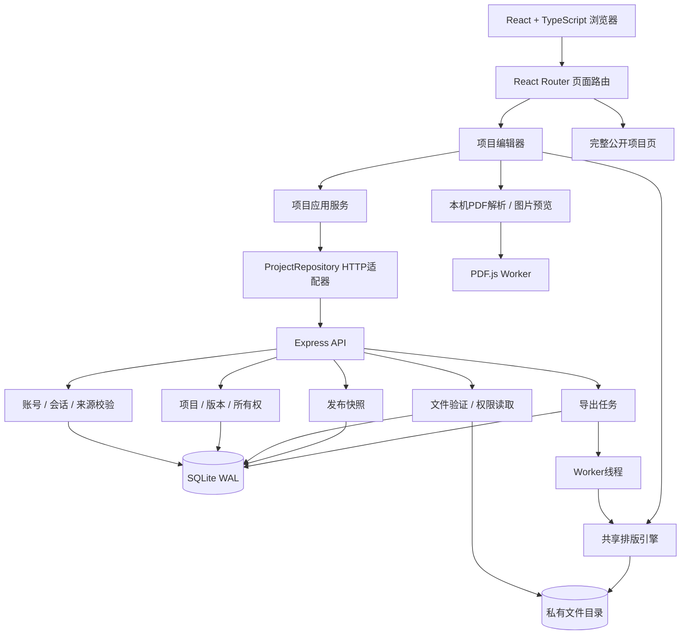
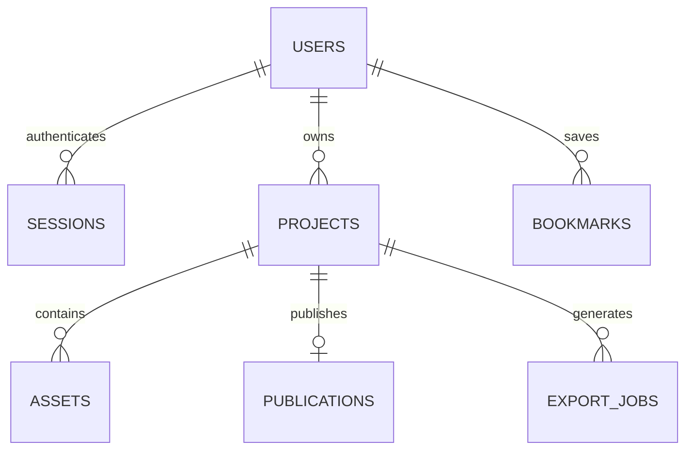

# 展序系统架构

## 产品模型

一个项目包含：封面、介绍、个人职责、制作工具、创作过程、自由内容模块、图片、演示视频、完整文件、在线体验与源码链接。

项目页是主展示载体。封面是入口；分页图文包是供简历与答辩使用的副产物。视频、ZIP源码和完整论文不会被伪装成一张图片中的全部内容。

## 当前实现

使用模块化单体Node API、SQLite和私有文件目录；生成任务用SQLite排队，并交给单独Worker线程渲染。选择此架构是为了让学生与其他使用者无需配置外部服务即可完整运行。



## 代码目录

```text
src/
  App.tsx                     应用壳、登录状态、页面路由
  pages/                      首页、模板、工作台、账号
  components/Editor.tsx       完整项目编辑与发布操作
  components/Showcase.tsx     模块化项目展示
  components/AuthDialog.tsx   登录注册
  domain/                     项目模型、仓库接口
  services/                   项目应用服务
  infrastructure/             HTTP仓库实现
  lib/api.ts                  统一API与上传客户端
  lib/import.ts               PDF页面/摘要提取
  lib/poster.ts               浏览器排版适配
  data/                       模板与明确标注的示例
shared/render.mjs              浏览器和服务器共用的排版规则
server/
  index.ts                    HTTP启动、中间件、静态网站
  auth.ts                     密码散列与会话
  projects.ts                 草稿、修订号、发布与撤回
  assets.ts                   文件上传、验证、私有访问、删除
  publications.ts             公开展示与收藏
  exports.ts                  SQLite任务队列和Worker管理
  export-worker.mjs           PNG/ZIP渲染
  db/schema-sqlite.sql         实际执行的数据结构
scripts/                      PDF资源复制、备份、浏览器测试
tests/api.test.ts              API集成测试
```

## 数据与权限



- users：邮箱唯一，密码使用带独立随机盐的scrypt散列；不存明文密码。
- sessions：数据库保存随机会话令牌的SHA-256摘要；浏览器使用HttpOnly、SameSite=Lax Cookie。修改密码使旧会话失效。
- projects：owner_id来自登录会话；document为经过校验的项目JSON，revision递增。
- assets：存储元数据与随机文件名；私有文件目录不作为静态目录暴露。请求时验证所有权。
- publications：保存独立内容快照和固定slug。编辑草稿不会立即改变公开页，更新发布才替换快照。
- export_jobs：固定项目修订号与输入快照，queued → running → succeeded/failed。相同项目、版本和导出类型复用作业。
- bookmarks：按账号存储收藏，不依赖浏览器本地收藏。

更新项目时携带revision；过期版本返回409，避免另一个页面覆盖更新。公开资产必须出现在当前有效发布快照中；猜到资产ID也不能读取私有文件。撤回后，公开API和公开文件地址均失效。

## 上传与项目组织

1. 登录后创建服务端项目。
2. 客户端逐个上传素材；服务端检查扩展名和内容签名，图片由sharp真实解码并重新编码。
3. 原始PDF保留，浏览器PDF.js尝试渲染前6页，再将生成的预览上传为图片。仅在识别到摘要边界时填入介绍。
4. 图片最多24张，视频/文件附件最多12个，自由模块最多8个。
5. 作者调整图片顺序、模块与附件公开选项，并保存草稿。
6. 发布前明确确认公开范围。PDF和ZIP默认私有，视频默认加入待发布展示；尚未点击发布时所有新素材仍是私有的。

ZIP仅存储、下载，不解压、不执行。软件项目运行在作者提供的在线体验地址，而不是本平台直接启动用户提交的代码。

## 两种导出

- 封面：1600×2000 PNG。
- 图文包：ZIP，包含封面、自动分页的文字介绍、每张图片的完整展示页，以及说明文件。图片页面等比完整放入；不会把24张图片挤进一张超长画布。

shared/render.mjs不依赖React或数据库。浏览器传入HTMLCanvasElement与Image；Worker传入@napi-rs/canvas。共享封面排版算法，避免预览与导出成为两套设计。

每次只运行一个Worker，防止大型渲染阻塞HTTP或同时耗尽内存。任务失败有错误状态并可重试；进程重启后会重新排队此前running的任务。字体通过系统安装，Docker包含Noto CJK；字体不同的系统可能产生轻微排版差异。

## 部署形态

开发：Vite 5173 → API 3001。生产：一个Node服务同时提供dist网页与/api接口。同域Cookie减少认证配置复杂度。

持久化目录含SQLite数据库和素材/导出文件。备份时停止写入，整体备份数据库与files。更换代码版本不能删除数据卷。

## 扩展边界

当出现实际规模需求时，可以把SQLite换成PostgreSQL，把私有文件目录替换为对象存储，把单进程队列替换为带租约的任务队列。需要保留现有所有权、快照、版本冲突与文件可见性语义。

旧PostgreSQL草案在 docs/postgresql-schema-draft.sql，仅为参考，不是当前数据库。当前没有单独微服务、云存储或AI服务。

## 当前限制

- 100项目/账号，100次素材上传/项目，默认500MB上传素材/账号。移除图片只改变项目引用，旧素材仍保留，避免破坏发布快照或历史导出；删除项目时回收关联文件。
- 每个账号的导出磁盘占用需随部署实际情况监控；当前没有自动淘汰旧导出文件的策略。
- 未实现OCR、邮件身份验证和密码找回、视频转码、内容审核、协作权限。
- SQLite运行目录应在本机持久磁盘；该版本不支持多应用实例共享一个数据库文件。

## 首屏资源

固定示例在构建阶段使用同一渲染器生成WebP，减少首页Canvas开销。真实用户项目仍采用动态预览。构建同时生成JS/CSS/Worker的Brotli和Gzip副本；生产API服务按Accept-Encoding返回压缩资源，普通Vite开发服务保持开发行为。
